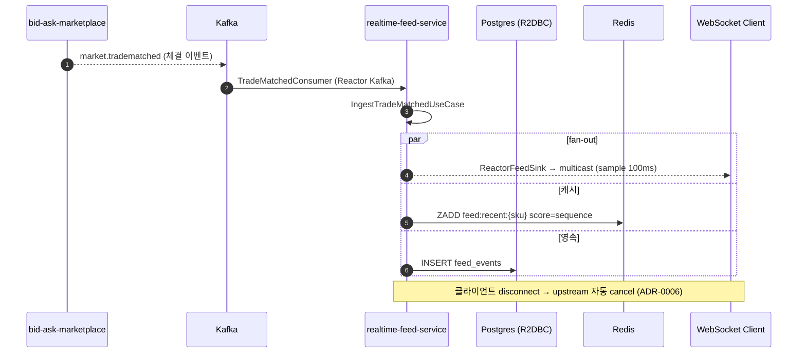
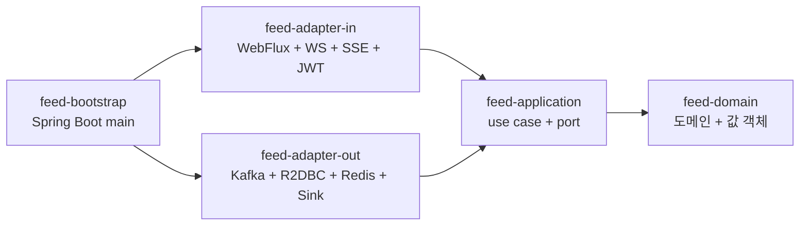
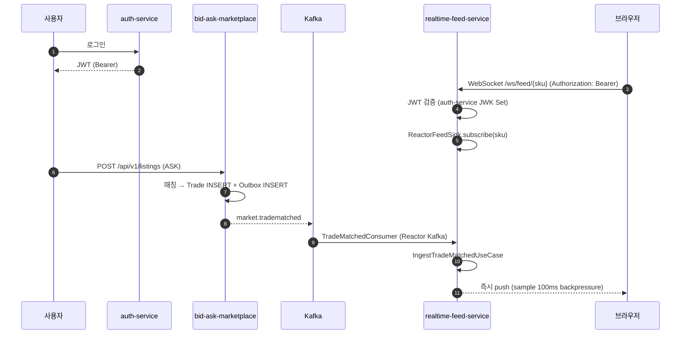

# Realtime Feed Service

[](https://github.com/ssa1004/realtime-feed-service/actions/workflows/ci.yml)
[](https://kotlinlang.org/)
[](https://openjdk.org/projects/jdk/21/)
[](https://spring.io/projects/spring-boot)
[](https://gradle.org/)
[](LICENSE)

리셀 마켓의 실시간 호가/체결 feed 를 WebSocket 과 SSE 로 fan-out 하는 백엔드입니다.
[`bid-ask-marketplace`](https://github.com/ssa1004/bid-ask-marketplace) 가 발행하는
체결 이벤트를 Kafka 로 consume 해서, SKU 단위 hot stream 으로 multicast 합니다.

portfolio 안의 다른 레포는 Spring MVC + JPA 인 반면, 본 레포는 Kotlin coroutines +
Spring WebFlux 로 구성되어 있습니다 — "언제 reactive 를 쓰지 말아야 하는가" 의 기준은
[ADR-0008](docs/adr/0008-when-not-to-use-reactive.md) 에 정리되어 있습니다.

## 기술 스택

- **Language**: Kotlin 2.0, Java 21 toolchain
- **Framework**: Spring Boot 3.4, Spring WebFlux (functional `coRouter`)
- **Concurrency**: Kotlin Coroutines (`suspend` / `Flow` / `StateFlow` / `Channel`),
  Project Reactor (`Mono` / `Flux` / `Sinks`)
- **DB**: PostgreSQL (R2DBC), Redis Reactive (Lettuce)
- **Messaging**: Apache Kafka (Reactor Kafka)
- **Push**: WebSocket + Server-Sent Events
- **Security**: Spring Security Reactive (OAuth2 Resource Server, JWT)
- **Test**: StepVerifier, kotlinx-coroutines-test
- **Build**: Gradle Kotlin DSL (`*.gradle.kts` only)

## 도메인

본 service 가 다루는 핵심 흐름:

1. `bid-ask-marketplace` 의 거래 매칭이 Kafka topic `market.tradematched` 로 발행됨
2. 본 service 의 Kafka consumer 가 receive → 도메인 [`FeedEvent.TradeMatched`](feed-domain/src/main/kotlin/com/example/feed/domain/FeedEvent.kt)
   로 변환
3. SKU 별 hot stream (`Sinks.many().multicast().onBackpressureBuffer`) 에 emit
4. 그 SKU 를 구독 중인 WebSocket / SSE 클라이언트가 즉시 받음 (sample 100ms backpressure)
5. 동시에 Redis SortedSet 에 캐시 (catch-up 용), R2DBC 에 영속



## 모듈 구조

헥사고날 (ports & adapters) 을 5 모듈로 분리. 의존 방향: `domain ← application ← adapter-* ← bootstrap`.



| 모듈 | 책임 |
|---|---|
| `feed-domain` | 순수 Kotlin 도메인. `SkuId`, `Money` (value class), `FeedEvent` (sealed interface), `FeedWindow` (집계). Spring 의존성 0 |
| `feed-application` | use case (`suspend fun`), port 인터페이스. Reactor 타입은 시그니처에서 노출 X (ADR-0001) |
| `feed-adapter-in` | WebFlux `coRouter` + WebSocket + SSE + Spring Security Reactive (JWT) |
| `feed-adapter-out` | Reactor Kafka consumer, R2DBC PostgreSQL, Reactive Redis (Lettuce), `Sinks.many().multicast()` 기반 fan-out |
| `feed-bootstrap` | Spring Boot main + `application.yml` + bean wiring |

## Quick Start

### 단일 모듈 단위 테스트

```bash
./gradlew check                   # 빌드 + 모든 테스트
./gradlew :feed-domain:test       # 도메인 단위
```

### 로컬 통합 시연 (docker-compose)

postgres + redis + kafka + auth-stub + 본 앱이 한 머신에서 뜹니다.

```bash
# 1. 통합 환경 기동
docker compose -p feed-integration -f infrastructure/docker-compose.yml up -d --build

# 2. mock JWT 발급 → SKU 구독 → mock 거래 이벤트 생성 → WebSocket / SSE 수신 시연
./scripts/integration-demo.sh

# 3. 정리
docker compose -p feed-integration -f infrastructure/docker-compose.yml down -v
```

`-p` 로 compose project 이름을 명시 — 같은 머신에서 다른 portfolio repo 의 compose 와
동시에 띄울 때 이름 / 포트 충돌을 피합니다 (본 앱: `8088`).

## API

### REST

| method | path | 설명 |
|---|---|---|
| `GET` | `/api/v1/feed/{skuId}/recent?limit=N` | 최근 N 건 조회 (catch-up 용). cache hit / store fallback |
| `GET` | `/api/v1/feed/{skuId}/window?minutes=M` | 최근 M 분 윈도우 통계 (volume / VWAP / high / low) |
| `GET` | `/api/v1/feed/{skuId}/stream` | SSE — `text/event-stream` |

### WebSocket

| path | 설명 |
|---|---|
| `/ws/feed/{skuId}` | text frame 으로 [`FeedEventDto`](feed-adapter-in/src/main/kotlin/com/example/feed/adapter/inbound/dto/Dtos.kt) JSON |

브라우저에서:
```javascript
const sse = new EventSource('/api/v1/feed/NIKE-DUNK-LOW-001/stream');
sse.addEventListener('TradeMatched', e => console.log(JSON.parse(e.data)));

const ws = new WebSocket('ws://localhost:8088/ws/feed/NIKE-DUNK-LOW-001');
ws.onmessage = e => console.log(JSON.parse(e.data));
```

## 주요 설계 결정

자세한 배경은 [docs/adr/](docs/adr/) 의 ADR 10건에 정리되어 있습니다.

| ADR | 주제 | 핵심 |
|---|---|---|
| [0001](docs/adr/0001-webflux-coroutines-boundary.md) | WebFlux ↔ Coroutines boundary | suspend / Flow 만 노출, Reactor 타입은 adapter 안에서만 |
| [0002](docs/adr/0002-bounded-elastic-isolation.md) | blocking 격리 | `boundedElastic` 의 한도 / elastic 동작 / `parallel` 과의 차이 |
| [0003](docs/adr/0003-backpressure-strategy.md) | backpressure 정책 | `sample` (client-facing) / `bufferTimeout` (batch) / `window` (통계) |
| [0004](docs/adr/0004-error-handling.md) | error handling | `onErrorResume` / `retryWhen` / `onErrorContinue` 금지 |
| [0005](docs/adr/0005-context-propagation.md) | 컨텍스트 전파 | Reactor Context ↔ CoroutineContext + MDC + Micrometer |
| [0006](docs/adr/0006-cancellation-propagation.md) | cancellation 전파 | WebSocket disconnect → upstream Kafka subscription cancel |
| [0007](docs/adr/0007-hot-stream-multicast.md) | hot stream multicast | `multicast()` + 별도 cache vs `replay(N)` trade-off |
| [0008](docs/adr/0008-when-not-to-use-reactive.md) | 언제 reactive 를 쓰지 말아야 하나 | CPU bound / 단순 CRUD / JPA 종속은 imperative 가 낫다 |
| [0009](docs/adr/0009-r2dbc-vs-jpa.md) | R2DBC vs JPA | 본 도메인이 R2DBC 인 이유 + R2DBC 의 한계 |
| [0010](docs/adr/0010-coroutines-structured-concurrency.md) | structured concurrency | `coroutineScope` vs `supervisorScope` + `withTimeout` 정책 |

## 운영 프로필 (`prod`)

`SPRING_PROFILES_ACTIVE=prod` 일 때 활성화되는 항목입니다.

- PostgreSQL / Redis / Kafka 실제 사용
- Spring Security Reactive 가 [auth-service](https://github.com/ssa1004/auth-service)
  의 JWK Set 으로 JWT 강제 검증
- Reactor Kafka consumer 활성 (`feed.kafka.enabled=true`)
- WebFlux graceful shutdown (`server.shutdown=graceful`)

dev 프로필은 인증을 우회하고 Kafka consumer 도 비활성 — 단순 endpoint 동작 시연용.

## 인프라

- `infrastructure/Dockerfile` — multi-stage 빌드 (JDK 21 build → JRE 21 distroless), non-root.
- `infrastructure/docker-compose.yml` — 로컬 통합 환경 (postgres + redis + kafka + 본 앱).
- `helm/realtime-feed-service/` — Kubernetes 배포용 Helm chart (`values.yaml` + `values-prod.yaml`).
- `.github/workflows/ci.yml` — 단위 테스트 + Helm chart lint → (push 시) GHCR 이미지
  빌드 + Trivy `HIGH,CRITICAL` 스캔. 현재는 `workflow_dispatch` 수동 trigger.
- `.github/workflows/codeql.yml` — CodeQL `java-kotlin` SAST. push / PR + 주 1회 정기 스캔.
- `.github/dependabot.yml` — gradle + github-actions 의존성 weekly 업데이트 PR.

### Helm chart

```bash
helm lint helm/realtime-feed-service
helm lint helm/realtime-feed-service -f helm/realtime-feed-service/values-prod.yaml
helm template feed ./helm/realtime-feed-service -n market

# 운영 배포
helm upgrade --install realtime-feed-service ./helm/realtime-feed-service \
  -n market --create-namespace \
  -f helm/realtime-feed-service/values-prod.yaml \
  --set image.tag=$(git rev-parse --short HEAD)
```

## 테스트

| 모듈 | 항목 | 검증 대상 |
|---|---|---|
| `feed-domain` | Money, FeedWindow, BidAskSnapshot | 도메인 invariants, VWAP, spread |
| `feed-application` | IngestTradeMatched, StreamFeed, ComputeWindowStats | 부수효과 격리, catch-up + realtime merge, 윈도우 집계 |
| `feed-adapter-in` | FeedRouter, FeedWebSocketHandler | REST 응답, WebSocket text frame, path 검증 |
| `feed-adapter-out` | ReactorFeedSink (StepVerifier 포함) | multicast fan-out, SKU 격리, mono { } boundary |
| `feed-bootstrap` | Application smoke | main class 등록 |

## Load test

reactive push 흐름 (WebSocket fan-out, SSE, sample 백프레셔) 을 k6 로 검증한다. 5
시나리오 — `websocket-fanout` / `sse-stream` / `rest-recent` / `rest-window` /
`backpressure` — 가 [`load/k6/scenarios/`](load/k6/scenarios) 에 있다.

```bash
# 통합 환경이 떠 있는 상태에서
./scripts/run-load.sh
```

스크립트는 로컬 `k6` 가 있으면 그것을, 없으면 `docker run grafana/k6` 를 사용한다.
결과는 `build/k6-reports/{scenario}.json` 으로 떨군다.

| 시나리오 | 검증 대상 | 주요 threshold |
|---|---|---|
| `websocket-fanout` | multicast fan-out (N 클라이언트 동시 구독) | `ws_connecting` p95 < 500ms, fail < 1% |
| `sse-stream` | SSE 연결 안정성 + 첫 이벤트 latency | `sse_first_event_latency` p95 < 1000ms |
| `rest-recent` | catch-up endpoint (cache hit 우세) | `http_req_duration` p95 < 100ms |
| `rest-window` | VWAP 집계 (R2DBC 비용) | `http_req_duration` p95 < 200ms |
| `backpressure` | slow consumer 의 sample 100ms 동작 | disconnect rate < 1%, drop 율 관측 |

docker-compose 의 `k6` 서비스는 `--profile load` 일 때만 활성화된다.

```bash
docker compose -p feed-integration -f infrastructure/docker-compose.yml \
    --profile load up k6
```

자세한 metric 해석 / 부하 모델 / 결과 예시는 [`load/README.md`](load/README.md) 참고.

## Portfolio Set 통합

이 레포는 단독으로도 동작하지만, 같은 사용자가 운영하는 10개 백엔드 레포가 한 시스템처럼
맞물리는 구성의 일부입니다. 프로필 README:
<https://github.com/ssa1004>.

### 인접 레포와의 관계

본 레포를 제외한 나머지 9개 레포와의 관계입니다.

| 레포 | 역할 | 본 레포와의 관계 |
|---|---|---|
| `auth-service` | 사용자 인증 + JWT 발급 | 본 레포가 JWK Set 으로 들어오는 JWT 를 검증 |
| `security-log-search` | 보안 로그 수집/검색 | 본 레포의 인증 실패 / 권한 위반 로그를 인덱싱 (선택) |
| `notification-hub` | 다채널 알림 | 본 레포는 직접 호출 없음 — 알림은 `bid-ask-marketplace` 가 담당 |
| `search-service` | 상품 검색 | 본 레포가 수집한 체결 이력을 검색에 노출 (향후) |
| `billing-platform` | 사용량 과금 | WebSocket 활성 connection 수를 usage 로 전송 (향후) |
| `bid-ask-marketplace` | 한정판 리셀 마켓 백엔드 | 본 레포의 upstream — `market.tradematched` 토픽을 본 레포가 consume |
| `gpu-job-orchestrator` | GPU job 스케줄러 | 본 레포는 직접 통합 없음 |
| `commerce-ops` | 관측 스택 | 본 레포의 metrics / trace / log 수집 |
| `graphql-gateway` | 통합 GraphQL 게이트웨이 | 본 레포의 REST 를 호출해 `Trade.feed` 필드로 노출 |

### 들어오는 / 나가는 통합점

- **들어오는** — `auth-service` JWT 로 인증된 클라이언트가 SSE / WebSocket 구독.
  Kafka 의 `market.tradematched` topic 을 `bid-ask-marketplace` 로부터 consume.
- **나가는** — Micrometer Observation 의 trace 가 `commerce-ops` 의 Tempo 로
  전송 (Reactor Hooks.enableAutomaticContextPropagation 으로 자동 전파, ADR-0005).

### 사용자 라이프사이클 sequence (호가 → 체결 → 실시간 feed)



### 통합 시연 — 외부 의존을 mock 으로 닫고 한 머신에서 한 사이클

```bash
# 1. 통합 환경 기동
docker compose -p feed-integration -f infrastructure/docker-compose.yml up -d --build

# 2. mock JWT 발급 → SSE / WebSocket 으로 구독 → mock 체결 이벤트 → 수신 시연
./scripts/integration-demo.sh

# 3. 정리
docker compose -p feed-integration -f infrastructure/docker-compose.yml down -v
```

실제 `auth-service` / `bid-ask-marketplace` 대신 같은 계약을 충족하는 stub 으로 닫혀 있어
한 머신에서 한 사이클을 마칠 수 있습니다.

## 향후 개선 사항

- BidAskSnapshot 의 push (호가창 변동 이벤트) — 현재는 TradeMatched 만.
- WebSocket 의 client-driven backpressure — flow control 메시지 도입.
- 다중 instance scale-out — sink 가 instance 별로 분리되므로 SKU sharding 또는 Redis
  pub/sub 로 instance 간 fan-out 동기화 필요.
- 의존성 / SAST 는 dependabot + CodeQL 로, 이미지 취약점은 Trivy (HIGH/CRITICAL fail) 로
  커버됨. dependency-track 기반 SBOM (CycloneDX / SPDX) 자동 생성은 향후 추가 예정.
